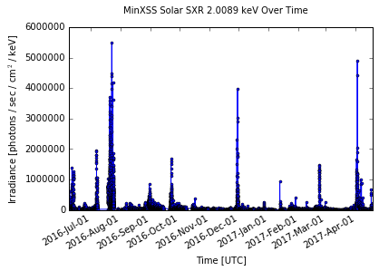
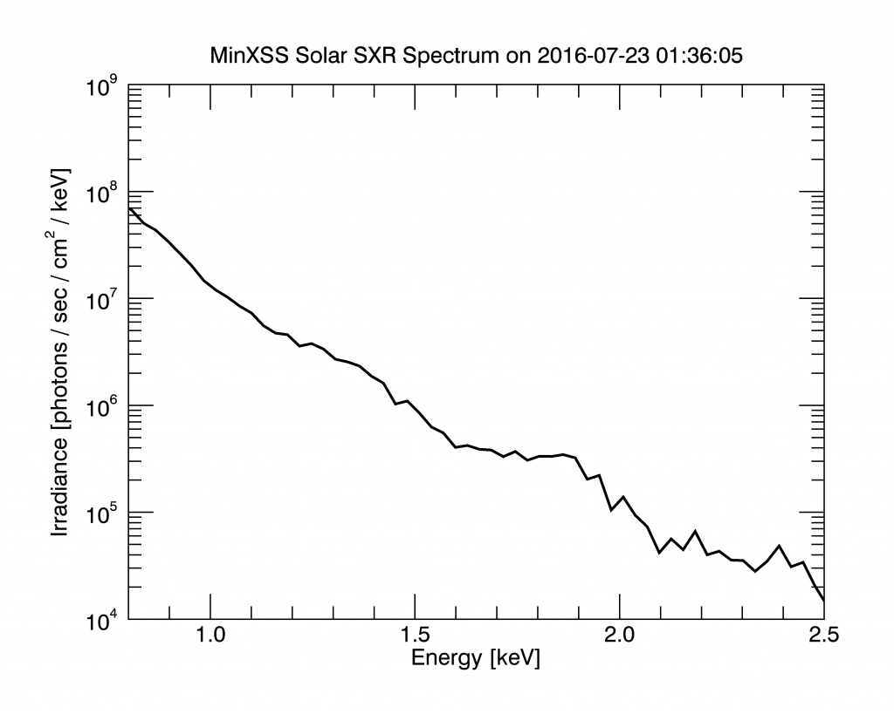
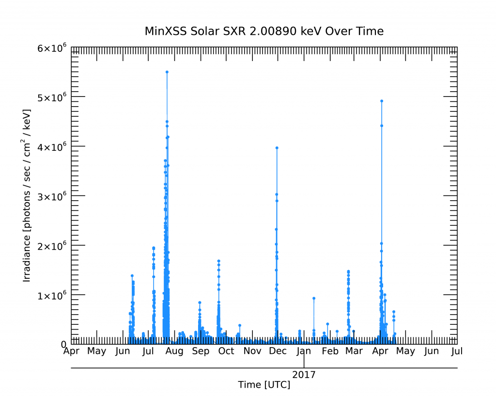

# Introduction

The *Miniature X-ray Solar Spectrometer* (*MinXSS*) CubeSat is a science mission for the NASA Heliophysics Division to better understand the energy distribution of solar flare soft X-ray (SXR) emissions and its impact on Earth’s ionosphere, thermosphere, and mesosphere (ITM). *MinXSS* measures the intensity of the soft x-ray solar spectrum from 0.5 keV (25 Å) to 15 keV (0.8 Å) with resolution of about 0.2 keV full-width half-max and with a 10 s cadence. The SXR spectral region is of particular interest for studying the energetics of solar flares and evolution of solar active regions.

*MinXSS* was developed as a student project at the University of Colorado in Boulder and the Laboratory for Atmospheric and Space Physics (LASP). The students along with a few scientists and engineers at LASP designed, built, integrated, tested, and operated the 3-Unit (3U) MinXSS CubeSat. Over 40 graduate students, 3 undergraduate students, and one high school student worked on MinXSS. It includes an Amptek X123 Silicon Drift Detector (SDD) as the main science instrument and was first to demonstrate the excellent attitude control of better than 10 arc-sec pointing with the Blue Canyon Technologies (BCT) Attitude Determination and Control System (ADCS). All other satellite subsystems were developed in-house. 

*MinXSS* was deployed from the International Space Station on 2016 May 16, and began normal operations on 2016 June 9. *MinXSS* re-entered (burned up) on 2017 May 6. The *MinXSS* mission was highly successful as both a technology demonstration mission for the BCT ADCS and as a science mission in obtaining thousands of high quality solar SXR spectra during the declining phase of solar cycle 23.  This is now considered as the MinXSS-1 mission as MinXSS-2 was launched in December 2018. 

For more details on the MinXSS design and science results, see the MinXSS project publication list at https://lasp.colorado.edu/home/minxss/science/publications/

Points of contact
* James Mason, *MinXSS* Instrument Scientist and Processing System Lead: `james.mason @ lasp.colorado.edu`
* Amir Caspi, *MinXSS* Instrument Scientist and Solar Physics Analysis Lead: `amir @ boulder.swri.edu`
* Thomas Woods, *MinXSS* PI, `tom.woods @ lasp.colorado.edu`

This *MinXSS* Data User Guide provides examples on how to use the *MinXSS* Level 1 product (its main science product) to examine solar SXR spectra and variability over time using some of the Python and IDL code provided with the *MinXSS-1* data archive.

Make sure that you’ve already downloaded the *MinXSS* data either as an [IDL saveset (.sav) from our website](http://lasp.colorado.edu/home/minxss/data/level-1/) or as a [netCDF from the archive at NASA](https://cdaweb.gsfc.nasa.gov/index.html/). Loading and plotting for data levels other than Level 1 are archived using similar syntax to that shown below. Just inspect the variables for differences in names. 

# Python

## Loading data

If you’re using the IDL saveset (.sav) from the MinXSS website:

```python
from scipy.io.idl import readsav
data = readsav(‘path/minxss1_l1_mission_length_v2.sav’)
minxsslevel1 = data.minxsslevel1.x123[0].copy()
```

or if using the netCDF files (.ncdf) from the NASA archive, make sure to have the Python netCDF4 package installed and do:

```python
import netCDF4
minxsslevel1 = netCDF4.Dataset('path/minxss1_solarSXR_level1_2016-05-16-mission_V002.ncdf')
```

where `path` is the path to the file. This generates a dictionary (`data`) containing the variables `minxsslevel1` and `minxsslevel1meta`. We copy `minxsslevel1` out for convenience, so that you don’t have to call `data.minxsslevel1` thereafter. `minxsslevel1` is a `numpy.recarray` (if loaded from saveset) or a `netCDF4.Dataset` if loaded from the netCDF file. 

To see what variables are available inside the `minxsslevel1` variable, at an interactive prompt (e.g., IPython) type (if loaded from the IDL saveset):

```python
minxsslevel1.dtype.names
```

or if loaded from the netCDF file:

```python
minxsslevel1.variables
# minxsslevel1['X123.IRRADIANCE'][0, 0, :]  # Example of slicing into a particular variable
```

If inside a script, just type the above inside of a `print()` statement.

## Plotting data

### A single spectrum

```python
%matplotlib inline  # comment out if not using Jupyter notebook
import matplotlib.pyplot as plt

spectrum_index = 2913
plt.plot(minxsslevel1[spectrum_index][‘energy’], minxsslevel1[spectrum_index][‘irradiance’], drawstyle=‘steps-mid’)
# plt.plot(minxsslevel1['X123.ENERGY'][0, spectrum_index, :], minxsslevel1['X123.IRRADIANCE'][0, spectrum_index, :], drawstyle='steps-mid')  # If loaded from netCDF
plt.xlim([0.8, 2.5])
plt.xlabel(‘Energy [keV]’)
plt.ylim([1e4, 1e9])
plt.yscale(‘log’)
plt.ylabel(‘Irradiance [photons / sec / cm$^2$ / keV]’)
plt.suptitle(‘MinXSS Solar SXR Spectrum on ‘ + minxsslevel1[spectrum_index][‘time’][‘human’][0].decode(“utf-8”))
plt.show()
```

which should result in this plot:


A python notebook that loads the data and creates the above plot can be downloaded [here](https://www.dropbox.com/s/83g0pgjxm7k0acv/MinXSS%20Plot%20Spectrum%20Example.ipynb?dl=0).

### A time series of a single bin

```python
%matplotlib inline  # comment out if not using Jupyter notebook
from scipy.io.idl import readsav
import matplotlib.pyplot as plt
import numpy as np
import datetime
import matplotlib.dates as mdates
# from astropy.time import Time  # If loading from netCDF

# Extract irradiance for the 73th bin corresponding to energy 2.0 keV
irradiance = minxsslevel1[‘irradiance’]
irradianceBin73 = np.zeros(len(irradiance))
for i in range(len(irradiance)):
  irradianceBin73[i] = irradiance[i][73]
# irradiance = minxsslevel1['X123.IRRADIANCE'][0, :, 73]  # If loaded from netCDF

# Extract time and convert it so that matplotlib can understand it
time_human = []
for i in range(len(irradiance)):
  time_human.append(minxsslevel1[i][‘time’][‘human’][0].decode(“utf-8”))
datetimes = [datetime.datetime.strptime(t, “%Y-%m-%d %H:%M:%S”) for t in time_human]
# datetimes = Time(minxsslevel1['X123_TIME.JD'][0, :]).datetime  # If loaded from netCDF

# Make the plot
fig, ax = plt.subplots(1)
plt.plot(datetimes, irradianceBin73, ‘b-o’, markersize = 3)
fig.autofmt_xdate()
ax.xaxis.set_major_formatter(mdates.DateFormatter(“%Y-%b-%d“))
plt.xlabel(‘Time [UTC]’)
plt.ylabel(‘Irradiance [photons / sec / cm$^2$ / keV]’)
plt.ylim([0, 8e8])
plt.suptitle(‘MinXSS Solar SXR ‘ + str(minxsslevel1[0][‘energy’][73]) + ‘ keV Over Time’)
plt.show()
```

which should result in this plot:



A python notebook that loads the data and creates the above plot can be downloaded [here](https://www.dropbox.com/s/oz6baz360ajj47c/MinXSS%20Plot%20Time%20Series%20Example.ipynb?dl=0).

# IDL

## Loading data

If you’re using the IDL saveset (.sav) from the MinXSS website:

```elixir
restore, path + path_sep() + ‘minxss1_l1_mission_length_v2.sav’
```

or if using the netCDF files (.ncdf) from the NASA archive:

```elixir
read_netcdf, path + path_sep() + 'minxss1_solarSXR_level1_2016-05-16-mission_V002.ncdf', minxsslevel1, minxsslevel1meta, status
```

where `path` is the path to the file. The built-in `path_sep()` function is used above to return a / for Linux/Mac (i.e., Unix) systems and a \ for Windows systems.

You can get the `read_netcdf` function, along with all other MinXSS code from [here](https://github.com/minxsscubesat/minxsscubesat/tree/master/minxss_library).

To see what variables are available inside the minxsslevel1 structure, just type:

```elixir
help, minxsslevel1, /STRUCTURE
```

For each sub-structure there, you can follow the same pattern, e.g.,

```elixir
help, minxsslevel1.x123, /STRUCTURE
```

## Plotting data

### A single spectrum

```elixir
p = plot(minxsslevel1.x123[2913].energy, minxsslevel1.x123[2913].irradiance, $
         TITLE = ‘MinXSS Solar SXR Spectrum on ‘ + minxsslevel1.x123[2913].time.human, $
         XTITLE = ‘Energy [keV]’, XRANGE = [0.8, 2.5], $
         YTITLE = ‘Irradiance [photons / sec / cm$^2$ / keV]’, YRANGE = [1e4, 1e9], $
         /YLOG)
```

which should result in this plot:



An IDL procedure that loads the data and creates the above plot can be downloaded [here]().

### A time series of a single bin 

```elixir
p1 = plot(minxsslevel1.x123.time.jd, minxsslevel1.x123.irradiance[73], $
          SYMBOL = ‘dot‘, SYM_THICK = 3, COLOR = ‘dodger blue’, $
          DIMENSIONS = [800, 600], $
          TITLE = ‘MinXSS Solar SXR ‘ + $
                   strtrim(minxsslevel1.x123[0].energy[73], 2) + ‘ keV Over Time’, $
          XTITLE = ‘Time [UTC]’, $
          XTICKFORMAT = [‘LABEL_DATE’, ‘LABEL_DATE’], $
          XTICKUNITS = [‘Month’, ‘Year’], $
          XTICKINTERVAL = 1, $
          YTITLE = ‘Irradiance [photons / sec / cm$^2$ / keV]’) 
```

which should result in this plot:



An IDL procedure that loads the data and creates the above plot can be downloaded [here](https://www.dropbox.com/s/05fv5futfbl9z5j/minxss_plot_timeseries_example.pro?dl=0).
